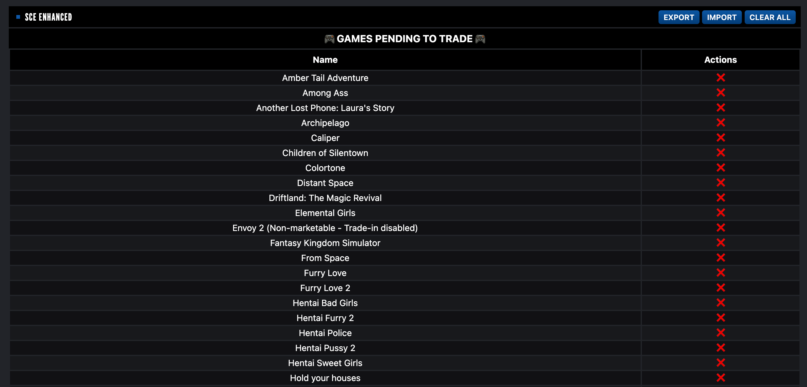
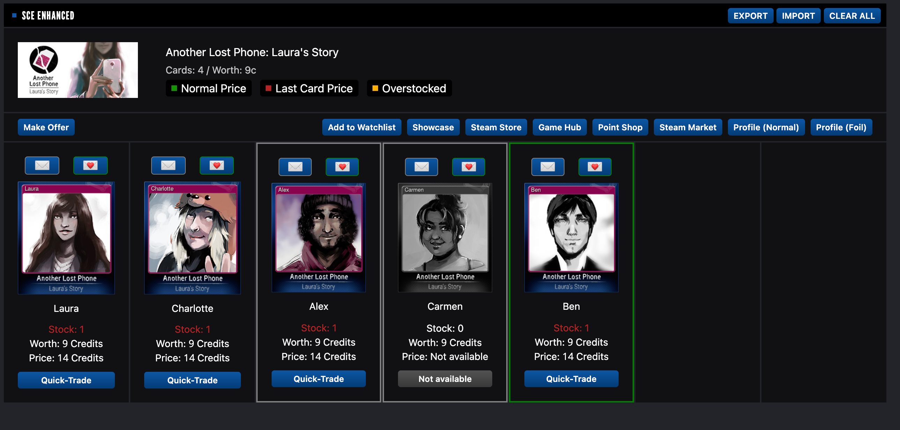

# 🃏Steam Card Exchange Enhanced🃏

This script enhanced the famous steam trading cards site **Steam Card Exchange** adding: 

* Game card inventory page: 
  * Mark/Unmark cards that you need/have to easily found it.
  * Export, import and clear buttons to handle users script configuration.  
* Inventory main page:
  * List of games with cards marked.
  * Export, import and clear buttons to handle users script configuration.

### Supported sites

- [Steam Card Exchange](https://www.steamcardexchange.net)

## 📌Prerequisites📎

- [Tampermonkey (Chrome)](https://tampermonkey.net)
- [Greasemonkey (Firefox)](http://www.greasespot.net)
- [Violent monkey (Opera)](https://addons.opera.com/sk/extensions/details/violent-monkey/)

## 🖥️Installation🖱️

**Github**

- Enter to the user script file (usually named as <code>*.user.js</code>) you want to install.
- Click on the <code>Raw</code> button, the browser extension will recognize this file as a user script.
- Install it.

That's it!

## 🔧Configuration🔧

No extra configuration required.

## 📷Screenshots📷

### ☕ Buy me a coffee ☕

If you want to support my scripts, consider to send me a tip: 
- [Paypal](https://paypal.me/sergiosusa?country.x=ES&locale.x=es_ES)
